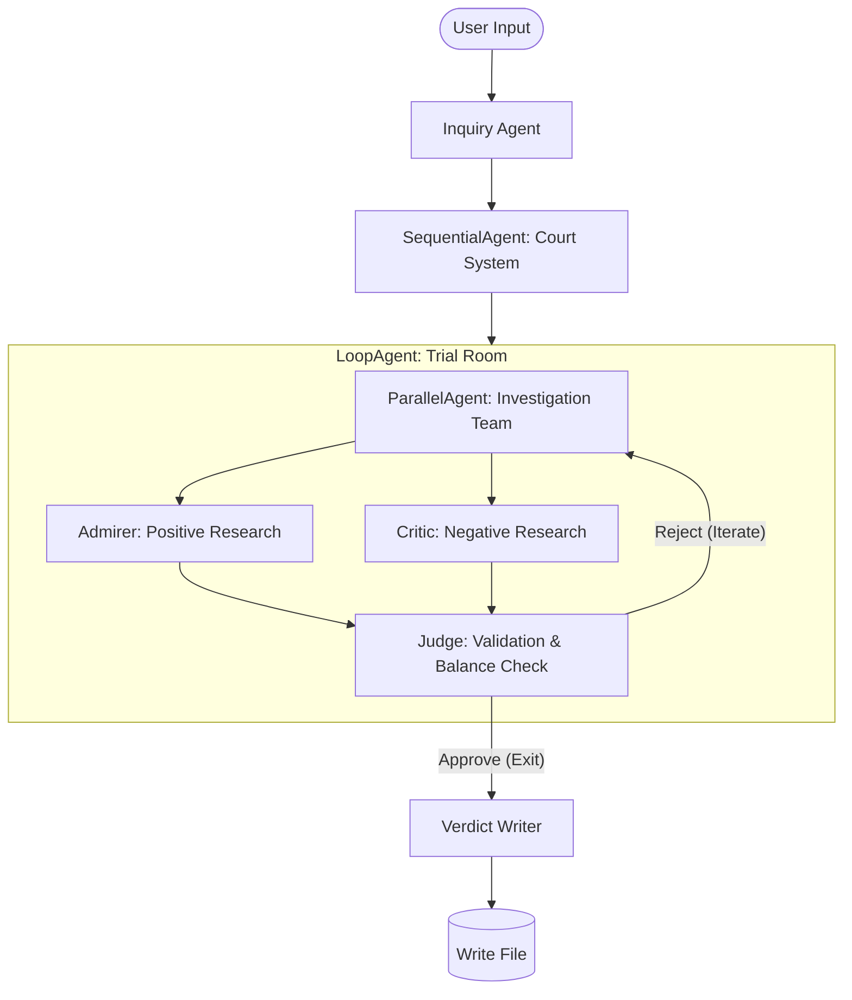

# The Historical Court (Multi-Agent System)

ระบบ Multi-Agent AI ที่จำลองศาลประวัติศาสตร์ โดยใช้ Google ADK และ Gemini Model  
ระบบจะวิเคราะห์บุคคลหรือเหตุการณ์ผ่านกระบวนการสืบสวน 2 ฝ่าย ได้แก่ ฝ่ายสนับสนุน และฝ่ายคัดค้าน
จากนั้นให้ผู้พิพากษาตรวจสอบความสมดุล ก่อนสรุปคำพิพากษาเชิงวิเคราะห์อย่างเป็นกลาง


# System Architecture



# Agent Roles

## 1️. Inquiry Agent
- รับหัวข้อจากผู้ใช้
- บันทึกลง state ใน field: `PROMPT`
- ส่งต่อไปยังระบบศาล


## 2️. Investigation Team (ParallelAgent)

### 2.1 Admirer
ค้นหาข้อมูลด้านบวกจาก Wikipedia:
- achievements
- accomplishments
- reforms
- legacy

เงื่อนไข:
- อย่างน้อย 120 คำ
- ห้ามกล่าวถึงด้านลบ
- บันทึกลง `pos_data`


### 2.2 Critic Researcher
ค้นหาข้อมูลด้านลบจาก Wikipedia:
- controversy
- criticism
- failures
- human rights issues

เงื่อนไข:
- อย่างน้อย 120 คำ
- ห้ามกล่าวถึงคำชม
- บันทึกลง `neg_data`


## 3️. Judge (Loop Control)

ตรวจสอบ:
- นับจำนวนคำจริง (word count จริง)
- แต่ละฝ่ายต้อง ≥ 120 คำ
- เนื้อหาต้องมีสาระ ไม่ซ้ำ

ถ้าไม่ผ่าน:
- เขียน feedback ลง `judge_feedback`
- ระบบจะวนลูปใหม่ โดยส่งกลับไปที่ Investigation Team

ถ้าผ่าน:
- เรียก `exit_loop`


## 4️. Verdict Writer

เมื่อข้อมูลครบถ้วน:
- เขียนรายงาน ≥ 350 คำ
- จัดรูปแบบด้วย:
  - H2 / H3
  - Bullet points
  - ตัวหนา
  - เส้นคั่น

โครงสร้าง:
1. บทนำ  
2. วิเคราะห์ด้านบวก  
3. วิเคราะห์ด้านลบ  
4. เปรียบเทียบเชิงวิพากษ์  
5. คำวินิจฉัยเชิงประวัติศาสตร์  

บันทึกไฟล์ลง:
```
court_agents/court_reports/
```


# Tools Used

## Wikipedia Tool
ใช้ผ่าน Langchain:

```python
WikipediaQueryRun(api_wrapper=WikipediaAPIWrapper())
```


## append_to_state
ใช้เก็บข้อมูลใน state:

```python
append_to_state(tool_context, field, response)
```


## write_file
บันทึกรายงานลงไฟล์:

```python
court_agents/court_reports/<filename>
```


## exit_loop
ใช้โดย Judge เมื่อผ่านเกณฑ์


# State Variables

| Field | Description |
|--------|------------|
| PROMPT | หัวข้อจากผู้ใช้ |
| pos_data | ข้อมูลด้านบวก |
| neg_data | ข้อมูลด้านลบ |
| judge_feedback | ข้อเสนอแนะจากผู้พิพากษา |


# Summary

Historical Court Agent System คือระบบ Multi-Agent Orchestration ที่ออกแบบมาเพื่อจำลองกระบวนการพิจารณาคดีเชิงประวัติศาสตร์ อย่างเป็นระบบและสมดุล  

ระบบแบ่งบทบาทของ AI ออกเป็น 4 ระดับ:

- **Investigation (Parallel Agents)** — ฝ่ายสนับสนุนและฝ่ายคัดค้านค้นคว้าข้อมูลพร้อมกันจาก Wikipedia
- **Judicial Review (Loop Validation)** — ผู้พิพากษาตรวจสอบจำนวนคำ ความครบถ้วน และความสมดุลของเนื้อหา
- **Iterative Refinement** — หากข้อมูลยังไม่ผ่านเกณฑ์ ระบบจะวนลูปปรับปรุงอัตโนมัติ
- **Structured Verdict Generation** — สร้างรายงานเชิงวิเคราะห์แบบเป็นกลาง พร้อมจัดรูปแบบอย่างเป็นทางการ

สถาปัตยกรรมผสาน:
- **Sequential Control**
- **Parallel Execution**
- **Adversarial Analysis**
- **Automated Quality Enforcement**

ผลลัพธ์คือรายงานเชิงวิเคราะห์ที่
- มีทั้งมุมมองด้านบวกและด้านลบ
- ผ่านการตรวจสอบเชิงปริมาณ (word count จริง)
- ลดอคติด้วยกลไกตรวจสอบแบบศาล
- มีโครงสร้างชัดเจน พร้อมบันทึกเป็นไฟล์

โปรเจกต์นี้เหมาะสำหรับ
- งานวิจัยเชิงประวัติศาสตร์
- การทดลอง Multi-Agent Systems
- การสาธิต AI Orchestration ขั้นสูง
- การสร้างระบบวิเคราะห์เชิงวิพากษ์แบบอัตโนมัติ


